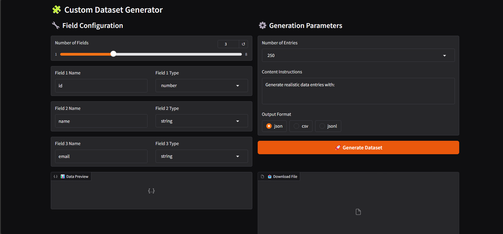

# Dataset Generator 🧩



A powerful tool for creating custom datasets using state-of-the-art LLMs from Hugging Face. Perfect for AI developers and researchers needing high-quality training data.

### Colab:
https://colab.research.google.com/drive/1OBwq5mZGO9T-YCAGeR7zw_JiDIAD-eT3?usp=sharing

## 🌟 Features

- **Multi-Format Output**: Generate datasets in JSON, CSV, or JSONL formats
- **Smart Field Configuration**: Define up to 8 custom fields with data types
- **Quantized Inference**: 4-bit quantization with BitsAndBytes for efficient processing
- **Interactive Preview**: Real-time data preview before download
- **Enterprise-Grade LLM**: Powered by Meta-Llama-3.1-8B-Instruct model

## 🚀 Quick Start

1. Install dependencies:
```bash
pip install -q transformers gradio torch accelerate bitsandbytes
```

2. Set up Hugging Face token:
```python
from google.colab import userdata
hf_token = userdata.get('HF_TOKEN2')  # For Colab users
```

3. Launch the interface:
```python
app.launch(debug=True)
```

## 🛠️ Configuration

**Model Settings:**
```python
quant_config = BitsAndBytesConfig(
    load_in_4bit=True,
    bnb_4bit_use_double_quant=True,
    bnb_4bit_compute_dtype=torch.bfloat16,
    bnb_4bit_quant_type="nf4"
)
```

**Supported Data Types:**
- String (text)
- Number (integer/float)
- Boolean (true/false)

## 📊 Interface Overview


1. **Field Configuration Panel**
   - Dynamic field count selector
   - Type-aware input validation
   - Smart field suggestions

2. **Generation Parameters**
   - Entry count selection (15-250)
   - Natural language instructions
   - Output format selector

## 💻 Example Usage

**Basic Configuration:**
```python
num_fields = 4
fields = [
    ("name", "string"),
    ("age", "number"),
    ("email", "string"),
    ("is_active", "boolean")
]
```

**Sample Prompt:**
```python
"Generate realistic user profiles for a social media platform with diverse demographics."
```

## ⚠️ Troubleshooting

**Common Errors:**
- `JSON Parsing Error`: Check for extra text in model output
- `Field Mismatch`: Verify field names match in all entries
- `Token Limits`: Reduce entry count for complex schemas

**Performance Tips:**
- Start with 15-50 entries for testing
- Use simple field names without special characters
- Clear error messages guide troubleshooting

## 🤖 Model Specifications

| Parameter            | Value                      |
|----------------------|----------------------------|
| **Base Model**       | Meta-Llama-3.1-8B-Instruct |
| **Quantization**     | 4-bit NF4                  |
| **Max Seq Length**   | 2000 tokens                |
| **Temperature**      | 0.7                        |
| **Top-p Sampling**   | 0.9                        |
| **Precision**        | bfloat16                   |
| **Device**           | CUDA (auto)                |

## 🌐 Use Cases

- Chatbot Training Data
- Sentiment Analysis Corpora
- AI Research Datasets
- Application Testing Data
- Machine Learning Benchmarks


---

**Powered By:**
- Hugging Face Transformers
- Meta Llama 3
- Gradio UI Framework
